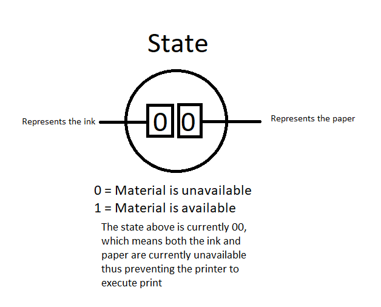
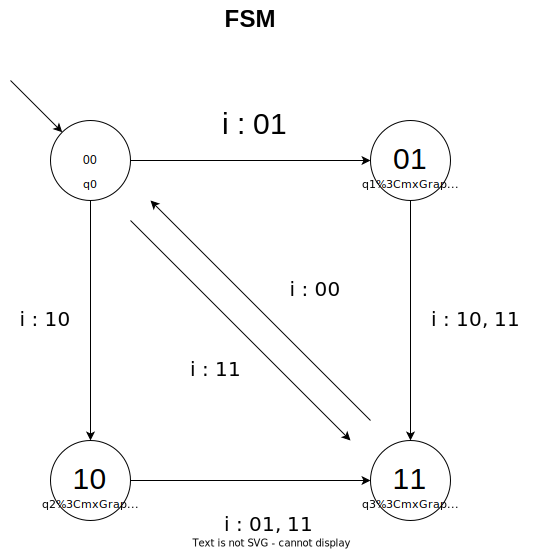

# FSM Printer
The following code is my FSM project simulating a printer process in C. The number of states in my FSM is four where each of the state representated in a string $s$ that contains two bits  . Now each corresponding state can be mapped to each combination of 1's and 0's like below:
|$q_n$|$s_n$|
|-----|--|
|$q_0$|00|
|$q_1$|01|
|$q_2$|10|
|$q_3$|11|

Now the two bits representation denotes the avaibility of the ink and paper respectively where 1 means available and 0 is not, look the figure below which is the state representation of $q_0$:
 

Now let input $i$ and output $o$ be a string with length of 2 that consist of 1's and 0's, now the transition state function for my FSM looks like the table below

<!-- |$q_n$|$s_n$|$i$ = 00|$i$ = 01|$i$ = 10|$i$ = 11|$o$|
|:---:|:---:|:------:|:------:|:------:|:------:|:-:|        
|$q_0$|00 |00      |01      |10      |11      |11 |
|$q_1$|01 |01      |01      |11      |11      |10 |
|$q_2$|10 |10      |11      |10      |11      |01 |
|$q_3$|11 |00      |11      |11      |11      |00 | -->
<table>
<thead>
  <tr>
    <th rowspan="2">q<sub>n</sub><br>(current state)</th>
    <th rowspan="2">s<sub>n</sub><br>(bit representation)</th>
    <th colspan="4">Next State</th>
    <th rowspan="2">o</th>
  </tr>
  <tr>
    <th>i = 00</th>
    <th>i = 01</th>
    <th>i = 10</th>
    <th>i = 11</th>
  </tr>
</thead>
<tbody>
  <tr>
    <td>q<sub>0</sub></td>
    <td>00</td>
    <td>00</td>
    <td>01</td>
    <td>10</td>
    <td>11</td>
    <td>11</td>
  </tr>
  <tr>
    <td>q<sub>1</sub></td>
    <td>01</td>
    <td>01</td>
    <td>01</td>
    <td>11</td>
    <td>11</td>
    <td>10</td>
  </tr>
  <tr>
    <td>q<sub>2</sub></td>
    <td>10</td>
    <td>10</td>
    <td>11</td>
    <td>10</td>
    <td>11</td>
    <td>01</td>
  </tr>
  <tr>
    <td>q<sub>3</sub></td>
    <td>11</td>
    <td>00</td>
    <td>11</td>
    <td>11</td>
    <td>11</td>
    <td>00</td>
  </tr>
</tbody>
</table>
<br>

Drawing the FSM Diagram it will look like the picture below:

The output for each state is the  flipped version of the current state bit representation
|$q_n$|$s_n$|$o_n$|
|:---:|:---:|:---:|
|$q_0$|00   |11   |
|$q_1$|01   |10   |
|$q_2$|10   |01   |
|$q_3$|11   |00   |
<br>

Now for the input $i$ each input has its own meaning, look the table below:
|$i$|Meaning|
|:-:|:-----:|
|00 |print  |
|01 |fill up the paper to the printer|
|10 |fill up the ink tank to the printer|
|11 |fill up both the paper and the ink tank to the printer|

Now if your refer to the image of my FSM diagram you will notice that the printer only prints if both the ink and the paper is available and when the "print" process is executed successfully the paper and ink supply will be gone.
<!-- ## Explanation
The state is representated with 2 bits of 0 and 1 each representing the availability of ink of paper so the left bit or MSB represents the ink while the right bit or LSB represents the paper, also the starting state if my FSM is $q_0$


The input $i$ acts as a supply, so if you put in "01" as the input it means "add paper to the printer", if you put "10" as the input then it means "add ink to the printer", and if you put "11" it means "add ink and paper to the printer", but if you put "00" as the input it will try to print which will run successfully if and only if both the paper and the ink is supplied

Lastly, the output $o$ only represents what material is insufficient (left bit for ink, right bit for paper) for the printer which is why the output is just the flipped version of the input $i$
|$i$|$o$|
|:-:|:-:|
|00 |11 |
|01 |10 |
|10 |01 |
|11 |00 |

So my machine will read the output from the left to right and if the machine reads the bit 1 it will prompt the user to fill up the ink or paper. -->

## Karnaugh Map
Using the table for transition state we can make the karnaugh map below: (note: $Q_n$ denotes the next state of $n$-nth bit from the left or MSB)


## Calculating
Now to convert the boolean equations above into the code we can express the $Q_n$ as an array like the snippet below:
```c
nextState[0] = currentState[0] & !currentState[1] | currentState[0] & input[1] | input[0];
```

```c
nextState[1] = !currentState[0] & currentState[1] | input[1] | currentState[1] & input[0];
```

## How to run code
You can run code by compile the main file first by typing make in the linux terminal
```
make
```
or using the compiler by typing the command below
```
gcc -o main.exe main_fsm.c
```
afterwards a new file will be created to run the file you can typing the command below
for linux:
```
./main.out
```

for powershell:
```
./main.exe
```

## Running
During the running process the program will start from the state $q_0$ which in bit representation is 00, you will need to input a string of two bits (0 or 1) seperated with space as example below:
```
0 0
```
depending from the input you will get feedback which depends from the output which is just the flipped version of the current state.