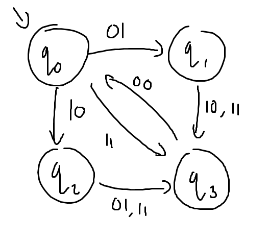
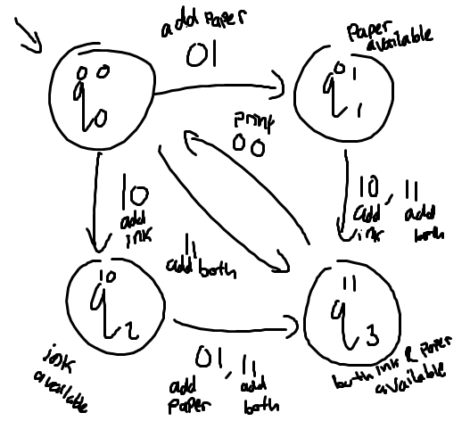

The following code is my FSM project simulating a printer process in C. The number of states in my FSM is four where each of the state representated in a string of two bits for now let the string representated as $s$. Now each corresponding state can be mapped to each combination of 1's and 0's like below:
|$q_n$|$s$|
|-----|--|
|$q_0$|00|
|$q_1$|01|
|$q_2$|10|
|$q_3$|11|

Now let input $i$ and output $o$ be a string with length of 2 that consist of 1's and 0's (00, 01, 10, 11), now the transition state function for my FSM looks like the table below

|$q$|$i$ = 00|$i$ = 01|$i$ = 10|$i$ = 11|$o$|
|---|:------:|:------:|:------:|:------:|:-:|        
|00 |00      |01      |10      |11      |11 |
|01 |01      |01      |11      |11      |10 |
|10 |10      |11      |10      |11      |01 |
|11 |00      |11      |11      |11      |00 |

Each state from the left bit to the right representing the avaibility of the ink and paper respectively where 1 means available and 0 is not, you will also notice that the output is the flipped version of the current state where the 1 swapped with 0 and vice versa. Drawing the FSM will looks like the picture below:

Each state has it owns meaning which i will start explaining from here.
<br>
## Explaination
The state is representated with 2 bits of 0 and 1 each representing the availability of ink of paper so the left bit or MSB represents the ink while the right bit or LSB represents the paper


The input $i$ acts as a supply, so if you put in "01" as the input it means "add paper to the printer", if you put "10" as the input then it means "add ink to the printer", and if you put "11" it means "add ink and paper to the printer", but if you put "00" as the input it will try to print which will run successfully if and only if both the paper and the ink is supplied

Lastly, the output $o$ only represents what material is insufficient (left bit for ink, right bit for paper) for the printer which is why the output is just the flipped version of the input $i$
|$i$|$o$|
|:-:|:-:|
|00 |11 |
|01 |10 |
|10 |01 |
|11 |00 |

So my machine will read the output from the left to right and if the machine reads the bit 1 it will prompt the user to fill up the ink or paper.

## Karnaugh Map
Using the table for transition state we can make the karnaugh map below: (note: $Q_n$ denotes the next state of $n$-nth bit from the left or MSB)


## Calculating
Now to change it into the code we can express the $Q_0$ as an array like the snipper below:
```c
nextState[0] = currentState[0] & !currentState[1] | currentState[0] & input[1] | input[0];
```

```c
nextState[1] = !currentState[0] & currentState[1] | input[1] | currentState[1] & input[0];
```